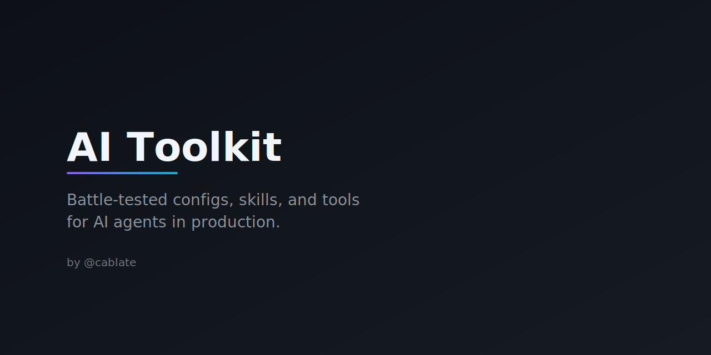

<p align="center">
  
</p>

<p align="center">
  <a href="README.zh-TW.md">繁體中文</a>
</p>

Battle-tested [Claude Code](https://docs.anthropic.com/en/docs/claude-code) configurations, skills, and tools from daily production use. Not theory — everything here is extracted from real workflows with AI agents.

## Skills

| Skill | Description |
|-------|-------------|
| [`/handoff`](skills/handoff/SKILL.md) | Session handoff — compress context into a structured prompt for seamless continuation |
| [`/thorough`](skills/thorough/SKILL.md) | Relentless delivery mode — exhaust all options, cost-aware model selection, verify before done |
| [`/agentskill-expertise`](skills/agentskill-expertise/SKILL.md) | Agent Skill design knowledge base — mechanisms, philosophy, patterns, pitfalls |
| [`/collaboration-style`](skills/collaboration-style/skill.md) | AI-human collaboration norms — friction cases, coding style, behavioral guidelines |

## Statusline

Cost and context awareness for Claude Code. Token usage (K precision), context bar, idle time, plan usage rates.

→ [`statusline/statusline.ps1`](statusline/statusline.ps1)

```jsonc
// ~/.claude/settings.json
{ "status_line_command": "powershell -NoProfile -File C:/Users/YOU/.claude/statusline.ps1" }
```

## Installation

### Symlink (recommended)

```bash
git clone https://github.com/cablate/ai-toolkit.git
cd ai-toolkit

# Symlink all skills at once — Linux / macOS
for skill in skills/*/; do
  name=$(basename "$skill")
  ln -sf "$(pwd)/$skill" ~/.claude/skills/"$name"
done

# Symlink all skills at once — Windows (PowerShell as Admin)
Get-ChildItem -Directory skills | ForEach-Object {
  New-Item -ItemType SymbolicLink -Force `
    -Path "$env:USERPROFILE\.claude\skills\$($_.Name)" `
    -Target "$PWD\skills\$($_.Name)"
}

# Statusline
cp statusline/statusline.ps1 ~/.claude/
```

### Direct copy

```bash
git clone https://github.com/cablate/ai-toolkit.git
cp -r ai-toolkit/skills/* ~/.claude/skills/
cp ai-toolkit/statusline/statusline.ps1 ~/.claude/
```

### Staying in sync

If you used symlinks, just `git pull` to get updates. If you copied, re-run the copy commands after pulling.

## Philosophy

One principle: **the AI is an owner, not an assistant.**

1. **AI agents quit too early.** `/thorough` fixes this.
2. **Session continuity is broken by design.** `/handoff` fixes this.
3. **You're flying blind on costs.** The statusline fixes this.

## Contributing

Issues and PRs welcome. Real-world tested, concrete behavior change, no hand-waving.

## License

[MIT](LICENSE)
